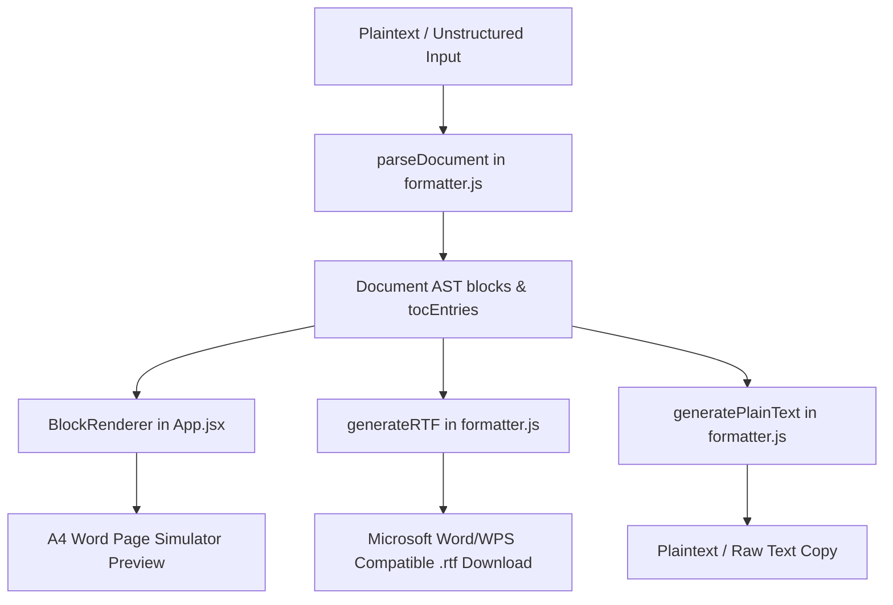

# DocFormat 📄 | SBSSU Industrial Training Report Formatter

An interactive web application built with **React 19** and **Vite 8** to format academic and industrial training reports according to the strict, formal formatting guidelines of **Shaheed Bhagat Singh State University (SBSSU)** (formerly Sardar Beant Singh State University).

It allows students and developers to paste their raw, unstructured text, auto-parse headings, tables, lists, and figures, view a real-time Word A4 page simulator preview, and instantly download a beautifully styled, Microsoft Word-compatible **Rich Text Format (.rtf)** document.

---

## 🚀 Key Features

*   **Smart Document Parsing**: Analyzes unstructured plaintext and constructs a structured Abstract Syntax Tree (AST) representing the document.
*   **SBSSU Guideline Compliance**: Automatically formats heading sizes, centering, lists, line spacings, and margins to comply with formal SBSSU requirements.
*   **Advanced Table Formatting**: Centered, full A4 width table layout, featuring dual-color zebra striping, all-bordered designs, and bold headers.
*   **Dual-Caption Intelligence**: 
    *   Table captions are placed **above** the tables.
    *   Figure captions are placed **below** the figures.
    *   *Anti-duplication logic*: Automatically detects if the user has already typed a caption (e.g., `Table 3.2 Frontend Technologies`) to prevent duplicate headings.
*   **Auto-TOC Generation**: Programmatically builds a dynamic Table of Contents with precise dot leaders, incorporating both preliminary pages (Certificate, Abstract, etc. using Roman numerals `i`, `ii`, etc.) and main chapters (using Arabic numerals).
*   **Manual Index Builder**: Provides a dedicated, interactive Table of Contents editor where users can customize levels (Prelim, Chapter, Section, Subsection), edit text, adjust page numbers, and download a custom-built RTF Index.
*   **High-Fidelity Word Preview**: Features an on-screen A4 page preview simulating exactly how the report will appear in Microsoft Word, WPS Writer, or Google Docs.
*   **Native RTF Compiling**: Implements a dedicated RTF generation engine that compiles the parsed AST directly into Rich Text Format syntax with full support for color tables, twips measuring, font tables (Times New Roman), and page margin definitions.

---

## 📐 Automated SBSSU Style Standards

| Element | Specification Applied |
| :--- | :--- |
| **Font Family** | Times New Roman (applied globally) |
| **Page Size** | A4 (`\paperw11906\paperh16838`) |
| **Page Margins** | Top/Bottom/Right: `1.0 in` (1440 twips) \| Left (for binding): `1.25 in` (1800 twips) |
| **Chapter Headings** | `16pt` Bold, Centered, Uppercase |
| **Section Headings (e.g., 1.1)** | `14pt` Bold, Left-Aligned |
| **Subsection Headings (e.g., 1.1.1)** | `14pt` Bold, Left-Aligned |
| **Sub-subsection Headings** | `12pt` Bold, Left-Aligned |
| **Body Paragraphs** | `12pt` Justified, **Double-Spaced** (`\sl480\slmult1`) |
| **Lists (Bullet/Number)** | `12pt` Justified, Double-Spaced, Left-Indented |
| **Tables** | A4 centered, automatic fit, dual-color row shading, solid boundaries |
| **Table Captions** | Centered, Bold `12pt`, placed **above** the table |
| **Figure Captions** | Centered, Italicized `12pt`, placed **below** the figure placeholder |

---

## 🛠️ Architecture & Data Flow



### Formatting Engine Details (`src/formatter.js`)
*   **Heading Detector**: Employs Regex scanners to differentiate Chapter starts from subsections like `1.1` or `1.1.1`, assigning levels `1` through `4`.
*   **Table Parser**: Recognizes Markdown pipe tables (`|`) and tab-separated formats, splitting them dynamically into header rows and alternating data rows.
*   **RTF Compiler**: Writes native RTF syntax strings using half-points (`\fs`) for font sizes, twips (1/20 of a point) for margins, and custom color tables (`\colortbl`) to render premium blue table borders, blue header backgrounds, and alternating shaded rows.

---

## 💻 Tech Stack

*   **Frontend Library**: [React 19](https://react.dev/)
*   **Development & Bundling Tool**: [Vite 8](https://vite.dev/)
*   **Languages**: HTML5, Modern ECMAScript (JavaScript), Vanilla CSS3
*   **Icons & UI**: Customized rich-themed components with dark borders, active state glows, and glassmorphic card stylings.

---

## 📂 Project Structure

```bash
DocFormat/
├── public/                 # Static assets
├── src/
│   ├── App.css             # Main styling, layout, typography, and Word preview frames
│   ├── App.jsx             # UI layouts, panel navigations, Index/TOC editor, and preview rendering
│   ├── formatter.js        # Core compiler: parsing logic, RTF/plain-text generator, and TOC rules
│   ├── index.css           # Global typography and background system
│   └── main.jsx            # Application mount point
├── eslint.config.js        # ESLint environment configurations
├── index.html              # HTML shell template
├── package.json            # Scripts and dependencies (Vite, React 19)
├── vite.config.js          # Vite build and server configurations
└── README.md               # Repository documentation
```

---

## ⚙️ Getting Started & Local Development

### 1. Prerequisites
Ensure you have [Node.js](https://nodejs.org/) installed (version 18+ recommended).

### 2. Installation
Clone the repository, navigate into the directory, and install dependencies:
```bash
# Navigate to project
cd DocFormat

# Install packages
npm install
```

### 3. Running Development Server
Start the local server with hot module reloading (HMR):
```bash
npm run dev
```
Open your browser and navigate to `http://localhost:5173`.

### 4. Build Production Bundle
Build the app into highly optimized static assets (output in `dist/` directory):
```bash
npm run build
```

---

## 📄 Sample Input Format

To test the formatting engine, you can load the sample input inside the app or paste text formatted as follows:

```text
Chapter 1 Introduction

This report outlines the development of the student portal during B.Tech industrial training.

1.1 Background
The university curriculum mandates a 6-week industrial training module.

Table 1.1 Development Milestones
Phase | Task | Duration
Phase 1 | Frontend Architecture | 2 Weeks
Phase 2 | Backend & DB Setup | 2 Weeks
Phase 3 | Testing & Deployment | 2 Weeks

Figure 1.1 Architecture Diagram
```

The system will compile this into a beautifully margined Word document, including an auto-generated Table of Contents, formatted headers, customized table rows, and correct spacing margins automatically!
